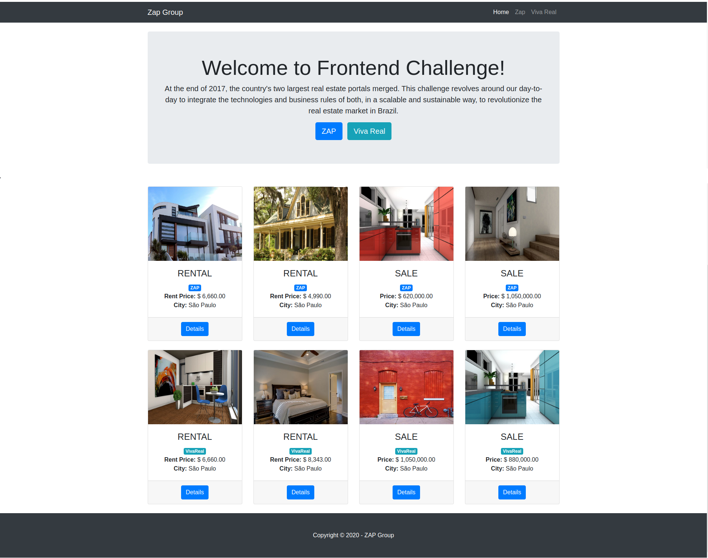

# Code Challenge Grupo ZAP - Frontend

This is the [Frontend Code Challenge](https://grupozap.github.io/cultura/challenges/engineering.html) project for the [&copy;Grupo ZAP](https://github.com/grupozap).

This project was generated with [Angular CLI](https://github.com/angular/angular-cli) version 8.3.24.

[Download](https://github.com/julianomacielferreira/eng-zap-challenge-frontend/archive/master.zip) this repository and follow the [installation steps](https://github.com/julianomacielferreira/eng-zap-challenge-frontend#install-dependencies) to get it up and running.

# Description

**The below description was taken from the [public available link](https://grupozap.github.io/cultura/challenges/engineering.html).**

At the end of 2017, the country's two largest real estate portals merged. This challenge revolves around our day-to-day to integrate the technologies and business rules of both, in a scalable and sustainable way, to revolutionize the real estate market in Brazil.

## Current code

The current code is very old, simple and raw (not to say crude). It is only used as a quick reference and will serve as a reference for this _challenge_. It works like this:
- Given a data source, it only has the logic of separating properties eligible for ZAP or Viva Real. You can see it [here](http://grupozap-code-challenge.s3-website-us-east-1.amazonaws.com/).

Below is the screenshots of the **current layout (from ZAP public link)** and **my redesigned layout**:

| Current             |  Redesigned |
:-------------------------:|:-------------------------:
 | 

## The current business rules are as follows:

- It is only eligible for the **ZAP** portal:
    - When **renting** and at least the amount is $3,500.00.
    - When **selling** and at least the value is $600,000.00.

- It is only eligible for the **Viva Real** portal:
    - When **renting** and at least the amount is $4,000.00.
    - When **selling** and at least the value is $700,000,00.

**Where:**

```js
...
pricingInfos: {
  price: 200000, // Sale value
  rentalTotalPrice: 1200, // Rent Amount
  businessType: "RENTAL|SALE", // defines whether it is rent or sale
}
```

## The challenge

Well, this is where you come in! We need this logic to be abstracted in the best way for the user. The legacy code is there to clear things up, in case you have any doubts. For the rest, it will not be used for anything.

### What will be evaluated?

- Organization
- Maintainability
- Traceability
- Testability
- Performance
- Portability
- Understanding the problem (your interpretation, as well as your understanding of the proposed rules is also part of the test, as we are evaluating how you understand and solve problems)

It must be **PRODUCTION READY**.

# Option A: Make an interaction interface (frontend)

Redesign the presentation and visual layer of the [legacy site](http://grupozap-code-challenge.s3-website-us-east-1.amazonaws.com/) the way you prefer, with some mandatory behaviors:

- When you click on a property, it should present a detail screen with its information.
- Allow the user the possibility to navigate between the photos of the property in the listing and / or detail.
- Pagination by 20 elements.
- **Responsive interface** (front) / **adaptable for different screens** (apps).

The logic (and [business rules](https://github.com/julianomacielferreira/eng-zap-challenge-frontend#business-rules-you-need-to-implement)) in this case is all in the front / app, so you will work with all data **in memory**. The _input_ must be accessed via request http (CORS friendly).

**Use your creativity** and take advantage of the property's information to show the card and the detail as you understand it would be the best form and also the most performative.

You should use ```source-1.json``` (~400 records) as input:

- [http://grupozap-code-challenge.s3-website-us-east-1.amazonaws.com/sources/source-1.json](http://grupozap-code-challenge.s3-website-us-east-1.amazonaws.com/sources/source-1.json)

# Business rules you need to implement

Now with the merger we have some changes that need to be made. The following rules need to be **added** to the existing rules mentioned at the beginning of this text:

- A property **is not** eligible under **ANY PORTAL** if:
    - It has ```lat``` and ```lon``` equal to 0.
- If the property is for **sale**, it is eligible for the **ZAP** portal if:
    - The square meter value (```usableAreas``` key) cannot be less than / equal to $3,500.00 (just divide ```price``` by ```usableAreas``` to know the square meter value) - only considering properties that have ```usableAreas``` above 0 (properties with _usableAreas = 0_ are not eligible).
    - **When the property is within the bounding box of the surroundings of the ZAP Group** (described below), consider the 10% lower minimum property value rule.
- If the property is for **rent**, it is eligible for the **Viva Real** portal if:
    - The value of the condominium (```monthlyCondoFee``` key) cannot be greater than / equal to 30% of the rental amount - only applied to properties that have a valid and numeric ```monthlyCondoFee``` (properties with non-numeric or invalid ```monthlyCondoFee``` are not eligible).
    - **When the property is within the bounding box of the surroundings of the ZAP Group** (described below) consider the 50% higher maximum value rule (of the rental of the property).

All the code handling the above business rules are implemented in this model class:

```javascript
export class Property {

  public id: string;
  public usableAreas: number;
  public parkingSpaces: number;
  public images: string[];
  public address: {
    city: string,
    neighborhood: string,
    geoLocation: {
      precision: string,
      location: {
        lon: number,
        lat: number
      }
    }
  };
  public bathrooms: number;
  public bedrooms: number;
  public pricingInfos: {
    period?: string | undefined,
    yearlyIptu: string | undefined,
    price: string | undefined,
    rentalTotalPrice?: string | undefined,
    businessType: string | undefined,
    monthlyCondoFee: string | undefined
  };

  constructor(private property?: any) {

    if(property !== undefined) {

      // Not all Json properties are necessary
      this.id = property.id,
          this.usableAreas = property.usableAreas,
          this.parkingSpaces = property.parkingSpaces,
          this.images = property.images,
          this.address = property.address,
          this.bathrooms = property.bathrooms,
          this.bedrooms = property.bedrooms,
          this.pricingInfos = {
              period: property.pricingInfos.period,
              yearlyIptu: property.pricingInfos.yearlyIptu,
              price: property.pricingInfos.price,
              rentalTotalPrice: property.pricingInfos.rentalTotalPrice,
              businessType: property.pricingInfos.businessType,
              monthlyCondoFee: property.pricingInfos.monthlyCondoFee
          };
    }
  }

  public isRentPropertiesForZAP(): boolean {

    // When renting and at least the amount is $3,500.00.
    return (
          this.isRental() && 
          this.isRentalTotalPriceAtLeast(3500)
    );
  }

  public isSellPropertiesForZAP(): boolean {

    if(
        this.isSale() && 
        this.isSaleTotalPriceAtLeast(600000) && 
        this.isSquareMeterValueGreaterThan(3500)
      ) {

        this.calculateZAPBoundingBox();
      
        return true;
    }

    return false;
  }

  public isRentPropertiesForVivaReal(): boolean {

    const PERCENTAGE: number = 30;

    if(
        this.isRental() && 
        this.isRentalTotalPriceAtLeast(4000) && 
        this.isMonthlyCondoFeeNotGreaterThanOrEqualTo(PERCENTAGE)
      ) {

        this.calculateVivaRealBoundingBox();

        return true;
    }

    return false;
  }

  public isSellPropertiesForVivaReal(): boolean {

    if(
        this.isSale() && 
        this.isSaleTotalPriceAtLeast(700000)
      ) {

        return true;
    }

    return false;
  }

  private isRental(): boolean {

    const businessType: string = this.pricingInfos.businessType;

    return (businessType === 'RENTAL');
  }

  private isRentalTotalPriceAtLeast(amount: number): boolean {

    const rentalTotalPrice: number = parseInt(this.pricingInfos.rentalTotalPrice);

    return (rentalTotalPrice >= amount);
  }

  private isSale(): boolean {

    const businessType: string = this.pricingInfos.businessType;

    return (businessType === 'SALE');
  }

  private isSaleTotalPriceAtLeast(amount: number): boolean {

    const price: number = parseInt(this.pricingInfos.price);

    return (price >= amount);
  }

  private isSquareMeterValueGreaterThan(amount: number): boolean {

    const usableAreas: number = this.usableAreas;

    // Only considering properties that have usableAreas above 0 (properties with usableAreas = 0 are not eligible).
    if(usableAreas <= 0) {
        return false;
    }

    // Divide price by usableAreas to know the square meter value
    const squareMeterValue: number = parseInt(this.pricingInfos.price) / usableAreas;

    // The square meter value  cannot be less than / equal to amount.
    return (squareMeterValue > amount);
  }

  private calculateZAPBoundingBox(): void {

      // When the property is within the bounding box of the surroundings of the ZAP Group,
      // consider the 10% lower minimum property value rule
      if(this.isAtGroupZAPBoundingBox()) {

        const price: number = parseInt(this.pricingInfos.price);

        const TEN_PERCENT: number = (price * 10) / 100;

        this.pricingInfos.price = (price + TEN_PERCENT).toString(); 
      }
  }

  private isAtGroupZAPBoundingBox(): boolean {

    const MIN_LONGITUDE:number = -46.693419;;
    const MIN_LATITUDE:number =  -23.568704;;
    const MAX_LONGITUDE:number =  -46.641146;
    const MAX_LATITUDE:number =  -23.546686;

    const location = this.address.geoLocation.location;

    return (location.lon >= MIN_LONGITUDE && location.lon <= MAX_LONGITUDE) && 
           (location.lat >= MIN_LATITUDE && location.lat <= MAX_LATITUDE);
  }

  private isMonthlyCondoFeeNotGreaterThanOrEqualTo(percentage: number): boolean {

    // Properties with non-numeric or invalid "monthlyCondoFee" are not eligible.
    if(this.pricingInfos.monthlyCondoFee === "0") {
      return;
    }

    const monthlyCondoFee: number = parseInt(this.pricingInfos.monthlyCondoFee);

    // "percentage" of the rental amount (rentalTotalPrice).
    const amount: number = (parseInt(this.pricingInfos.rentalTotalPrice) * percentage) / 100;

    return (monthlyCondoFee < amount);
  }

  private calculateVivaRealBoundingBox(): void {

    // When the property is within the bounding box of the surroundings of the ZAP Group, 
    // consider the 50% higher maximum value rule (of the rental of the property).
    if(this.isAtGroupZAPBoundingBox()) {

      const rentalTotalPrice: number = parseInt(this.pricingInfos.rentalTotalPrice);

      const FIFTY_PERCENT: number = (rentalTotalPrice * 50) / 100;

      this.pricingInfos.rentalTotalPrice = (rentalTotalPrice + FIFTY_PERCENT).toString(); 
    }
  }
}
```

**Where:**

```js
{
  ...
  updatedAt: "2016-11-16T04:14:02Z", // property update date
  address: {
    geolocation: {
      location: { // latitude / longitude of the property
        "lon": -46.716542,
        "lat": -23.502555
      },
    },
  },
  pricingInfos: {
    monthlyCondoFee: "495"
  }
}
```

### Bounding Box Grupo ZAP

```js
minlon: -46.693419
minlat -23.568704
maxlon: -46.641146
maxlat: -23.546686
```

### Input / Output contract example

JSON with data is minified, so to facilitate its development, here is an example of it:

```js
[
  {
    "usableAreas": 69,
    "listingType": "USED",
    "createdAt": "2016-11-16T04:14:02Z",
    "listingStatus": "ACTIVE",
    "id": "some-id",
    "parkingSpaces": 1,
    "updatedAt": "2016-11-16T04:14:02Z",
    "owner": false,
    "images": [
      "https://resizedimgs.vivareal.com/crop/400x300/vr.images.sp/some-id1.jpg",
      "https://resizedimgs.vivareal.com/crop/400x300/vr.images.sp/some-id2.jpg",
      "https://resizedimgs.vivareal.com/crop/400x300/vr.images.sp/some-id3.jpg",
      "https://resizedimgs.vivareal.com/crop/400x300/vr.images.sp/some-id4.jpg",
      "https://resizedimgs.vivareal.com/crop/400x300/vr.images.sp/some-id5.jpg"
    ],
    "address": {
      "city": "",
      "neighborhood": "",
      "geoLocation": {
        "precision": "ROOFTOP",
        "location": {
          "lon": -46.716542,
          "lat": -23.502555
        }
      }
    },
    "bathrooms": 2,
    "bedrooms": 3,
    "pricingInfos": {
      "yearlyIptu": "0",
      "price": "405000",
      "businessType": "SALE",
      "monthlyCondoFee": "495"
    }
  },
  {
    "usableAreas": 70,
    "listingType": "USED",
    "createdAt": "2017-04-22T18:39:31.138Z",
    "listingStatus": "ACTIVE",
    "id": "some-id-2",
    "parkingSpaces": 1,
    "updatedAt": "2017-04-22T18:39:31.138Z",
    "owner": false,
    "images": [
      "https://resizedimgs.vivareal.com/crop/400x300/vr.images.sp/some-id-2-1.jpg",
      "https://resizedimgs.vivareal.com/crop/400x300/vr.images.sp/some-id-2-2.jpg",
      "https://resizedimgs.vivareal.com/crop/400x300/vr.images.sp/some-id-2-3.jpg",
      "https://resizedimgs.vivareal.com/crop/400x300/vr.images.sp/some-id-2-4.jpg",
      "https://resizedimgs.vivareal.com/crop/400x300/vr.images.sp/some-id-2-5.jpg"
    ],
    "address": {
      "city": "",
      "neighborhood": "",
      "geoLocation": {
        "precision": "ROOFTOP",
        "location": {
          "lon": -46.716542,
          "lat": -23.502555
        }
      }
    },
    "bathrooms": 1,
    "bedrooms": 2,
    "pricingInfos": {
      "yearlyIptu": "60",
      "price": "276000",
      "businessType": "SALE",
      "monthlyCondoFee": "0"
    }
  }
]
```

In case you need to validate the input and do not want to use the entire sources, there are example sources:

- [http://grupozap-code-challenge.s3-website-us-east-1.amazonaws.com/sources/source-sample.json](http://grupozap-code-challenge.s3-website-us-east-1.amazonaws.com/sources/source-sample.json)
- [http://grupozap-code-challenge.s3-website-us-east-1.amazonaws.com/sources/source-sample](http://grupozap-code-challenge.s3-website-us-east-1.amazonaws.com/sources/source-sample)

## Install Dependencies

**1. Check if you have a recent version of [Node.js](https://nodejs.org/) (which comes bundled with [npm](https://www.npmjs.com/), a JavaScript package manager) and [Angular CLI](https://angular.io/guide/setup-local#step-1-install-the-angular-cli):**

```bash
$ node -v
```

```bash
$ npm -v
```

```bash
$ ng --version
```

**2. Install node modules:**

```bash
$ npm install
```

## Development server

Run `ng serve` for a dev server. Navigate to `http://localhost:4200/`. The app will automatically reload if you change any of the source files.

## Code scaffolding

Run `ng generate component component-name` to generate a new component. You can also use `ng generate directive|pipe|service|class|guard|interface|enum|module`.

## Build

Run `ng build` to build the project. The build artifacts will be stored in the `dist/` directory. Use the `--prod` flag for a production build.

## Running unit tests

Run `ng test` to execute the unit tests via [Karma](https://karma-runner.github.io).

## Running end-to-end tests

Run `ng e2e` to execute the end-to-end tests via [Protractor](http://www.protractortest.org/).

## Further help

To get more help on the Angular CLI use `ng help` or go check out the [Angular CLI README](https://github.com/angular/angular-cli/blob/master/README.md).

# Running with Docker

You must have [Docker](https://docs.docker.com/install/) and [Docker Compose](https://docs.docker.com/compose/install/) installed.

In the root project folder build the image and fire up the container:

```bash
$ docker-compose up -d --build
```

Open your browser to **http://localhost:4200** and you should see the app. Try making a change to the AppComponent’s template (src/app/app.component.html) within your code editor. You should see the app hot-reload. 

Ensure the app is running in the browser and test hot-reloading again. 

Stop the container before moving on:

```bash
$ docker-compose stop
```

# References

- Angular: [https://angular.io/](https://angular.io/)

- Bootstrap: [https://getbootstrap.com/](https://getbootstrap.com/)

- Bootstrap Template: [Heroic Features](https://startbootstrap.com/templates/heroic-features/)

- Font Awesome&trade;: [https://fontawesome.com/](https://fontawesome.com/)

- Sass&trade;: [https://sass-lang.com/](https://sass-lang.com/)

- Webpack&trade;: [https://webpack.js.org/](https://webpack.js.org/)

- TypeScript: [https://www.typescriptlang.org/](https://www.typescriptlang.org/)

- Node.js: [https://nodejs.org/](https://nodejs.org/)

- Code Challenge Grupo ZA: [https://grupozap.github.io/cultura/challenges/engineering.html](https://grupozap.github.io/cultura/challenges/engineering.html)

# License

Please see the [license agreement](https://github.com/julianomacielferreira/eng-zap-challenge-frontend/blob/master/LICENSE).
